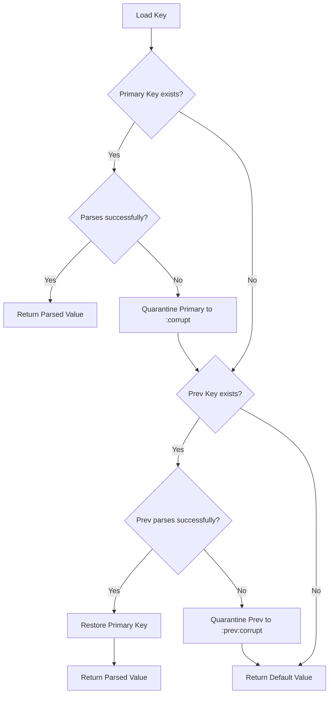

# Architecture & Design Decisions

This document details the architectural layout, modules, data models, and core engineering choices of the Greenfield Multi-Tracker Dashboard.

## Core Principles

1. **Buildless ES Modules**: The application uses native JavaScript modules (`import`/`export`) loaded directly via `index.html`. No bundlers (Vite, Webpack), compilers (Babel), or package installations are required to run the dashboard.
2. **Offline-First & Serverless**: All data state remains local to the user's browser via the standard `localStorage` API.
3. **Registry Pattern**: Individual trackers are treated as modular entities listed in a central index, loading specific records dynamically when requested.

---

## 1. Storage & Corruption Recovery

Data integrity is critical when relying solely on local storage. A corrupted string should never lead to data loss or screen crashes.

### Key Namespaces
- `trackers:index`: Registry metadata overview list: `Array<{ id, name, type, archived, createdAt }>`.
- `tracker:<id>:meta`: Full configuration data of a single tracker: `{ id, name, type, schema: FieldSchema[], archived, createdAt }`.
- `tracker:<id>:entries`: Array of records. For `course` trackers, this is the list of topics/modules. For `log` trackers, this is the list of activity entries.
- `tracker:theme`: User theme selection (`light` or `dark`).

### Corruption Recovery Diagram


---

## 2. Schema Definition & Validation

Field definitions for log trackers allow custom metrics to be added dynamically.

### FieldSchema Model
```typescript
interface FieldSchema {
  key: string;       // Unique identifier (starts with a letter, alphanumeric/underscores)
  label: string;     // Friendly header displayed in lists and tables
  kind: "text" | "number" | "date" | "select";
  unit?: string;     // Optional unit descriptor (e.g., "km", "kg", "min")
  options?: string[]; // Options list for "select" inputs
}
```

### Validation Rules
- **Schema Validation**: Checks that all field keys are unique, valid alphanumeric slugs, and that kinds match allowed values.
- **Entry Validation**: Compares raw JSON data fields against the schema. Number fields must be numeric, date fields must be valid `YYYY-MM-DD` strings, and select fields must match the options pool.
- **Merge Logic**: Course topics are merged using a unique `slug(section, name)`. If a topic name and section match existing records, the study stats (status, confidence, timers, history) are retained.

---

## 2.5 Course Tracker Data Model & Study Signals

Syllabus/Course trackers use a structured topic format that records historical progress directly on the topic objects.

### Topic Data Structure
```typescript
interface CourseTopic {
  id: string;              // Unique section + name slug
  section: string;         // Parent section header
  name: string;            // Name of the specific skill/topic
  reference: string;       // Chapter or page number reference
  status: "Not Started" | "Learning" | "Practising" | "Mastered";
  conf: string;            // Current confidence score ("1" to "5" or "")
  reviewed: string;        // Date of last logged review (YYYY-MM-DD)
  note: string;            // Study note or concept cheat sheet
  strength: number;        // Bjork spacing strength multiplier
  reviewHistory: Array<{ date: string, confidence: number, source: string }>;
  studySeconds: number;    // Accumulated study seconds
  lastStudySeconds: number;// Duration of the last study session
  tests: Array<{ date: string, score: number, outOf: number, confidence: number, note: string }>;
  errors: Array<{ date: string, type: string, note: string, status: "active" | "resolved" }>;
}
```

### Study Signals Heuristics
Syllabus topics evaluate duration, reviews count, and test failures to generate flags:
1. **Friction**: time &ge; 45m and conf &le; 2 (stuck on the topic).
2. **Needs Retrieval**: time &ge; 25m and 0 reviews (needs review active recall).
3. **Brittle**: time &le; 12m, conf &ge; 4, and last test failed (false confidence).
4. **Ready Test**: time &ge; 20m, conf &ge; 4, last test passed, and status is not "Not Started" (validation due).
5. **Efficient**: time &gt; 0 and &le; 10m, conf &ge; 4, and last test passed.

### Study Timer Architecture
- Timer state is stored in `localStorage` under `tracker:activeTimer` containing `{ trackerId, topicId, startedAt }`.
- A single background interval in `main.js` ticks duration every second, rendering updates to DOM displays and displaying a global app-level banner.

---

## 3. UI Design System

Aesthetics are handled via a layered design system of CSS custom properties defined in `theme.css`.

- **Typography**: Display elements use `Fraunces` for a high-end, premium feel. Text elements use `Newsreader` for high readability.
- **Color Palettes**:
  - *Light (Ink/Paper)*: Designed as a warm, high-contrast cream-colored theme with subtle gold highlights.
  - *Dark (Sleek Dark)*: Swaps primary shades to high-contrast blues and golds with matching soft borders to reduce eye strain.
- **Transitions**: Smooth micro-animations (`transform`, `box-shadow`) are added to card containers and interactive buttons to create a responsive, tactile UI.
