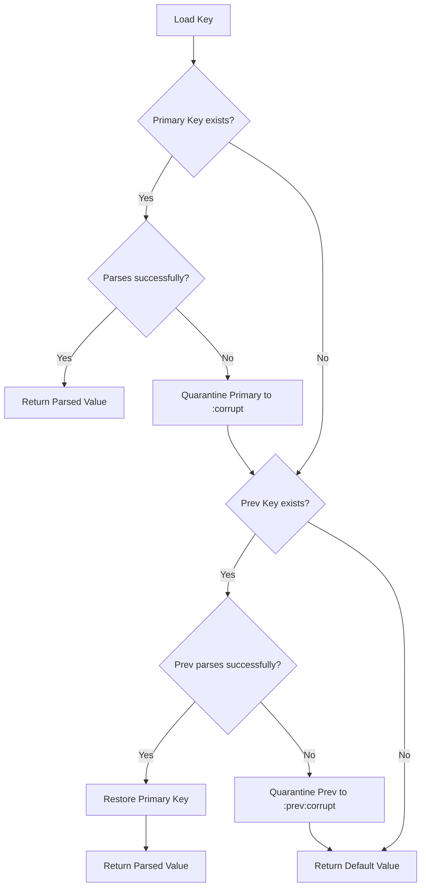

# Architecture & Design Decisions

This document details the architectural layout, modules, data models, and core engineering choices of the Greenfield Multi-Tracker Dashboard.

## Core Principles

1. **Buildless ES Modules**: The application uses native JavaScript modules (`import`/`export`) loaded directly via `index.html`. No bundlers (Vite, Webpack), compilers (Babel), or package installations are required to run the dashboard.
2. **Offline-First & Serverless**: All data state remains local to the user's browser via the standard `localStorage` API.
3. **Registry Pattern**: Individual trackers are treated as modular entities listed in a central index, loading specific records dynamically when requested.

---

## 1. Storage & Corruption Recovery

Data integrity is critical when relying solely on local storage. A corrupted string should never lead to data loss or screen crashes.

### Key Namespaces
- `trackers:index`: Registry metadata overview list: `Array<{ id, name, type, archived, createdAt }>`.
- `tracker:<id>:meta`: Full configuration data of a single tracker: `{ id, name, type, schema: FieldSchema[], archived, createdAt }`.
- `tracker:<id>:entries`: Array of records. For `course` trackers, this is the list of topics/modules. For `log` trackers, this is the list of activity entries.
- `tracker:theme`: User theme selection (`light` or `dark`).

### Corruption Recovery Diagram


---

## 2. Schema Definition & Validation

Field definitions for log trackers allow custom metrics to be added dynamically.

### FieldSchema Model
```typescript
interface FieldSchema {
  key: string;       // Unique identifier (starts with a letter, alphanumeric/underscores)
  label: string;     // Friendly header displayed in lists and tables
  kind: "text" | "number" | "date" | "select";
  unit?: string;     // Optional unit descriptor (e.g., "km", "kg", "min")
  options?: string[]; // Options list for "select" inputs
}
```

### Validation Rules
- **Schema Validation**: Checks that all field keys are unique, valid alphanumeric slugs, and that kinds match allowed values.
- **Entry Validation**: Compares raw JSON data fields against the schema. Number fields must be numeric, date fields must be valid `YYYY-MM-DD` strings, and select fields must match the options pool.
- **Merge Logic**: Course topics are merged using a unique `slug(section, name)`. If a topic name and section match existing records, the study stats (status, confidence, timers, history) are retained.

---

## 3. UI Design System

Aesthetics are handled via a layered design system of CSS custom properties defined in `theme.css`.

- **Typography**: Display elements use `Fraunces` for a high-end, premium feel. Text elements use `Newsreader` for high readability.
- **Color Palettes**:
  - *Light (Ink/Paper)*: Designed as a warm, high-contrast cream-colored theme with subtle gold highlights.
  - *Dark (Sleek Dark)*: Swaps primary shades to high-contrast blues and golds with matching soft borders to reduce eye strain.
- **Transitions**: Smooth micro-animations (`transform`, `box-shadow`) are added to card containers and interactive buttons to create a responsive, tactile UI.
