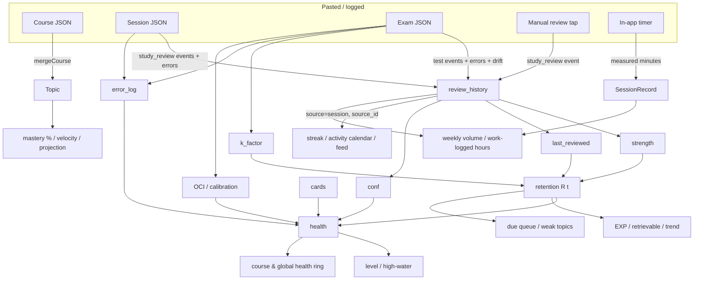

# Cairn — Data Flow Map

A complete map of how data enters the app, how it is transformed, and how every
surfaced metric is derived. Written for handing to an AI to reason about
improvements. All file paths are repo-relative.

## 0. Governing principles (read first)

These constraints shape everything below — any improvement must respect them:

1. **Local-first, zero network.** No AI calls, no backend. All state lives in
   `localStorage` under one key (`studyos-store`). AI is used only *outside* the
   app: the app emits copy-out prompts and ingests pasted JSON.
2. **Event-sourced.** The atomic unit of truth is the **`ReviewEvent`** appended
   to a topic's `review_history`. Sessions and exams are *decomposed* into events
   on ingestion; they are not stored as first-class rows (except the additive
   `Store.sessions[]` side-channel and `Store.exams[]`, see §6).
3. **Derive, don't store.** Retention, health, levels, EXP, streaks, projections
   — none are persisted. They are recomputed live from the event log every
   render. "Nothing stored can go stale."
4. **Append-only + monotonic where it matters.** `strength` only grows;
   `mastered_at` is never cleared; history is never mutated. Level "high-water"
   and `workLogged` are monotonic by construction.
5. **Single recalculation path.** Every event — session, exam, manual review —
   goes through `applyEvent` (`src/engine/recalculate.ts`). There is no
   per-source duplicate math.
6. **Honesty rules.** Never-reviewed retention is `null` → UI shows "—", never
   0%. The app is the only timekeeper (AI-supplied durations are ignored).

All tunable constants live in `src/config/constants.ts` (`CONFIG`) — no magic
numbers inline.

---

## 1. The data model (`src/domain/types.ts`)

```
Store
├── schema_version
├── courses: Course[]
│   └── sections: Section[]
│       └── topics: Topic[]          ← the unit everything derives from
├── exams:   Exam[]                  ← raw exam rows (for the feed + "papers" count)
└── sessions: SessionRecord[]        ← additive side-channel: REAL measured durations
```

### Topic — the core aggregate

| field | written by | read by (derived) |
|---|---|---|
| `status` (`not_started`→`learning`→`practising`→`mastered`) | learner (status control) + auto-seed on first event | health surfacing, levels, weak/due filters, mastery %, velocity |
| `conf` (1–5) | every event (`confidence_reported`) | `confidenceScore`, OCI, badges |
| `strength` (grows only) | every event (`strengthIncrement`) | **retention**, velocity, badges |
| `k_factor` (clamped 4.2–16.8) | **tests only** (drift tuning) | **retention**, projected due |
| `cards` (flashcard count) | (not event-sourced; direct) | `cardScore`, `under_carded` badge |
| `last_reviewed` | every event (`event.date`) | **retention**, projected due |
| `mastered_at` (never cleared) | first arrival at `mastered` | velocity, projection, level high-water |
| `drift_history` (last 5) | tests only | `k_factor` tuning |
| `review_history: ReviewEvent[]` | **all ingestion** | almost every metric |
| `error_log: ErrorLogEntry[]` | sessions + exams | `errorScore`, `activeErrorCount`, badges, remediate briefing |

### ReviewEvent — the atomic fact

```ts
{ event_id, date, kind, source, source_id, confidence_reported, test?, notes? }
```
- **`kind`** = `study_review | test_pass | test_fail` → *drives the math* (strength increment; whether drift/k tuning runs).
- **`source`** = `session | exam | manual_review` → *provenance only*, orthogonal to kind. Used by streaks, activity feed, weekly volume.
- **`test`** (present iff kind is a test) = `{ score, out_of, actual_retention = score/out_of }` → OCI, calibration, drift.
- **`source_id`** groups events into their originating session/exam (how sessions are reconstructed for the feed/calendar).

### ErrorLogEntry
```ts
{ error_id, date, source, source_id, error_type, description, resolved, resolved_date }
```
`resolved` toggled directly in UI (`useStore.toggleError`); it does *not* create an event.

### SessionRecord (`Store.sessions[]`) — the duration side-channel
```ts
{ session_id, topic_id, course_id, created_at, completed_at,
  duration_minutes /* measured by the in-app timer */, intent, scope, timer_mode, pomodoro_config? }
```
This is the **only** carrier of real study time. The pasted session JSON's
`duration_minutes` is discarded on merge; the timer's measured value is written
here at commit.

---

## 2. Ingestion pipeline (`src/core/pipeline.ts`)

Data enters ONE way: the learner pastes AI-produced JSON into `AddFlow`.

```
paste string
  → detectSchema (core/detect.ts)         guess course | session | exam
  → parseJson (core/validate.ts)          stop on syntax error, show where
  → validateAgainst (Ajv, schemas.ts)     collect ALL schema errors
  → checkIntegrity (core/integrity.ts)    e.g. topic_ids must resolve, no dup course
  → buildPreview                          human summary; commits nothing yet
  → [user confirms]
  → commit (clone store → merge → swap)   atomic: throw leaves live store intact
```

`commit` clones the store, runs `mergeInto` on the draft, and returns it; the
hook (`useStore`) only adopts the draft after `saveStore` succeeds.

**Two commit entry points** (`src/hooks/useStore.ts`):
- `commitValue(schema, value)` — normal path (course / exam / standalone session).
- `commitSession(value, meta)` — start-session flow: commits the session JSON via
  the same pipeline **and** appends a `SessionRecord` with `duration_minutes =
  meta.measured_minutes` (never the AI's value). One persisted update.

Other direct (non-paste) writers on `useStore`:
- `logManualReview(topicId, confidence)` → a `study_review` event with `source: manual_review` (one-tap review).
- `promoteTopic(topicId, status)` → status change (+ auto-seed / `mastered_at` via `promote`).
- `toggleError`, `replaceStore` (import), `clearStore`.

---

## 3. The single recalculation path (`src/engine/recalculate.ts`)

Every event decomposed in §4 is applied by **`applyEvent(topic, event, now)`**,
which returns a new Topic:

```
review_history        ← append event
strength              ← strength + strengthIncrement(kind, confidence)   (only grows)
conf                  ← event.confidence_reported
last_reviewed         ← event.date
IF kind is a test AND event.test:
    drift             = test.actual_retention − predictRetention(topic, event.date)   (vs curve BEFORE this event)
    drift_history     ← push(drift), keep last DRIFT_WINDOW(5)
    k_factor          ← tuneKFactor(...)   (only after ≥DRIFT_MIN(3) samples; ±K_STEP(10%); clamp [K_MIN,K_MAX])
IF topic.status == not_started:
    promote(→ learning)   (seeds strength=1.0, stamps last_reviewed)
```

`strengthIncrement` (`CONFIG.STRENGTH_GAIN`): test_pass **1.5**, test_fail
**0.15**, study_review conf≤2 **0.3**, conf=3 **0.6**, conf 4–5 **1.0**.

**This is the mechanism by which exams outweigh sessions:** only tests carry a
`test` block, so only exams push drift and self-tune `k_factor` (which bends the
whole retention curve), and only test_pass gives the big +1.5 strength bump and
unlocks the level validation cap (§5).

`promote` (also `src/engine/recalculate.ts`) owns the only two automatic status
rules: seed on first exit from `not_started`, stamp `mastered_at` on first
`mastered`.

---

## 4. How each ingestion type decomposes (`src/core/merge.ts`)

| Input | Becomes | Notes |
|---|---|---|
| **Course** | topics stored as-is (status `not_started`, strength 0, k=8.4) | `mergeCourse`; normalises `mastered_at` to null |
| **StudySession** | per `topics_covered[]`: 1 `ReviewEvent{study_review, source:session}` + push `error_log` entries → `applyEvent` | `mergeSession`; `duration_minutes` **ignored** (see SessionRecord) |
| **Exam** | pushed to `store.exams[]`; per `linked_topic_ids`: 1 `ReviewEvent{test_pass|test_fail, source:exam}` + `test` block + errors → `applyEvent` | `mergeExam`; kind derived from marks (`≥80%`); uses `breakdown[]` if present else uniform score; per-topic recalculation against each topic's own prior state |
| **Manual review** | 1 `ReviewEvent{study_review, source:manual_review}` → `applyEvent` | via `useStore.logManualReview`, not the paste pipeline |

Errors are pushed to `error_log` **before** `applyEvent` so the engine sees the
correct active-error count for that moment.

---

## 5. Per-topic derived metrics

### Retention (`src/engine/retention.ts`) — the core signal
```
R(t) = e^(−t / (k_factor · strength))          t = whole days since last_reviewed
```
- `predictRetention` → 0–1, or **null** if never reviewed / not_started.
- `retentionPct` → 0–100 or null.
- `isDue` → R < `DUE_THRESHOLD` (0.70).
- `projectedDue` → solves R = 0.70 for t: `t_due = −k·s·ln(0.70)`.

### Health (`src/engine/metrics.ts`) — weighted 0–100
```
health = 0.30·retentionScore + 0.25·errorScore + 0.20·calibrationScore
       + 0.15·confidenceScore + 0.10·cardScore
```
Sub-scores:
- `retentionScore` = R·100 (0 if null).
- `errorScore` = by **active** error count: 0→100, 1→70, 2→40, ≥3→0.
- `calibrationScore` = 100·(1−|OCI|), floored at 0; **100 if the topic has no tests**.
- `confidenceScore` = conf/5·100.
- `cardScore` = min(100, cards·20).
- Only *surfaced* for practising/mastered (`shouldShowHealth`), but computable always.

### Overconfidence Index (OCI)
```
OCI = mean over tests of [ conf/5 − score/out_of ]   (0 if no tests)
```
Only exams (tests) move OCI/calibration. Sessions never do.

### Badges (`badges`) — diagnostic flags
`slow_growth` (≥3 reviews & velocity<0.5), `boredom_zone` (conf5, ≥4 reviews, 0 errors, not failed), `brittle_fluency` (conf≥4 & last test failed), `under_carded` (≥2 active errors & 0 cards), `ready_to_test` (conf≥4, has tests, not failed, velocity≥0.5).
`topicVelocity = strength / reviewCount`.

### Levels (`src/engine/leveling.ts`) — 0–5, live view
- `topicLevel` = how many `HEALTH_BANDS [25,45,62,78,90]` the topic's health clears, gated:
  - `not_started` → 0.
  - no passed test → capped at `UNVALIDATED_CAP` (3).
  - not `mastered` → capped at MAX_LEVEL−1 (4). Level 5 requires mastery.
- `topicLevelHighWater` = the **ratchet**: max `topicLevel` over every past event date + `mastered_at`, reconstructed via `topicStateAsOf` (replay). Non-decreasing.
- `levelUps(old,new)` = topics whose high-water rose this commit → celebration toasts.

---

## 6. Aggregations (what the screens read)

### Course-level (`src/engine/course.ts`)
- `weakTopics` — lowest health first (excl. not_started/mastered) → dashboard weak list.
- `courseHealth` — mean health of active topics → the hero ring.
- `averageRetention` — mean live R.
- `velocity` — topics reaching `mastered` in last 4 weeks / 4; **undefined** until ≥2 ever mastered.
- `projectFinish` — always a *range* (best/worst via ±25%); "not enough data" guard.
- `dueQueue` — R<0.70, most-decayed first, with **section spreading** (interleaves subjects).

### Overview / cross-course (`src/engine/overview.ts`)
- `globalHealth`, `globalDueQueue`, `overallMastery` (mastered ÷ total topics).
- `studyStreak` — consecutive days with a `source:session` event (today-or-yesterday grace).
- `weeklyVolume` — sessions in last 7 days (by `source_id` + recent `SessionRecord`s); **hours** = Σ real `duration_minutes` (or 30-min proxy when no record).
- `activityFeed` — chronological stream; sessions reconstructed by grouping events by `source_id`; exams from `store.exams`.

### Progress / EXP (`src/engine/progress.ts`)
- `retrievable` — **EXP = Σ retention** over started topics; `ceiling` = count of started topics. "What can I retrieve today."
- `expTrend` — EXP over last 7 days; past points reconstructed by forward-replay (`topicStateAsOf`); today short-circuits to live `retrievable`.
- `workLogged` — session count (by `source_id`) + hours (real `SessionRecord` or 30-min proxy) + `papers` = `exams.length`. Monotonic.

### History / charts (`src/engine/history.ts`)
- `retentionSeries` — mean R per day over last N days (rebuilds `topicAsOf`).
- `activitySeries` — sessions per day (dedup by `source_id`) → the Study-activity heatmap + Overview streak calendar.

### Replay (`src/engine/replay.ts`)
`topicStateAsOf(topic, date)` rebuilds strength/last_reviewed/status at a past
date from `review_history` (used by high-water and expTrend). **Not rewound:**
`k_factor` (drift adjustments aren't individually timestamped) and `cards` (not
event-sourced) — deliberate approximations.

---

## 7. Dependency graph (raw → derived → surfaced)



---

## 8. Notable seams & approximations (candidate improvement areas)

- **k_factor isn't rewound** in replay → past trend/level points use today's k.
  Only exams tune it, so session-heavy users never benefit from self-tuning.
- **`cards` is not event-sourced** — a direct field, held constant in replay; the
  only non-reconstructable input to health/levels.
- **Duration is a side-channel.** Sessions logged before the start-session
  feature (or standalone-logged) have no `SessionRecord` → hours fall back to a
  flat 30-min proxy. Count is exact; hours are approximate.
- **Sessions never touch calibration/OCI or k_factor** — all self-tuning and
  calibration signal comes from exams. A learner who never logs exams gets a
  static curve (k fixed at 8.4) and calibration pinned at 100.
- **Manual reviews and sessions are indistinguishable to the math** (both
  `study_review`); only `source` differs, which only streak/volume/feed read.
- **`confidence_reported` is self-reported** and feeds strength, conf, health,
  and (for exams) OCI — the main subjective input.
- **EXP is unweighted Σ retention** by design (strength rewarded temporally, not
  in magnitude) — a deliberate choice worth revisiting for how it reads.
- **Level high-water only recomputes for topics touched this commit** (perf
  shortcut); a `cards` change alone won't re-evaluate levels.
- **Errors resolve via a direct flag, not an event** — resolving an error isn't
  in `review_history`, so it doesn't appear in the trend/feed, only in health.

---

## 9. File index

| Concern | File |
|---|---|
| Types / schema shapes | `src/domain/types.ts`, `src/domain/schemas.ts` |
| Constants | `src/config/constants.ts` |
| Ingest pipeline | `src/core/pipeline.ts`, `detect.ts`, `validate.ts`, `integrity.ts`, `merge.ts` |
| Storage / migration | `src/core/storage.ts` |
| Core math | `src/engine/recalculate.ts`, `retention.ts` |
| Per-topic metrics | `src/engine/metrics.ts`, `leveling.ts`, `replay.ts` |
| Aggregations | `src/engine/course.ts`, `overview.ts`, `progress.ts`, `history.ts`, `exams.ts` |
| Session feature | `src/engine/session.ts`, `src/core/focusDraft.ts`, `src/hooks/useStudyTimer.ts` |
| Commit surface | `src/hooks/useStore.ts` |
```
